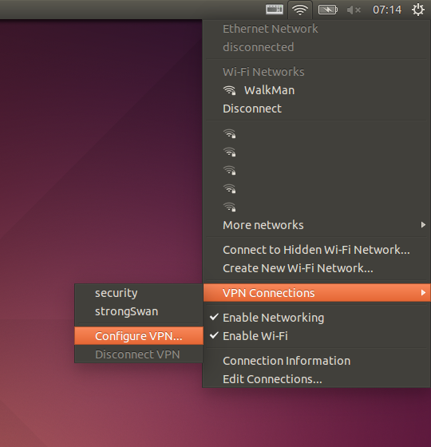
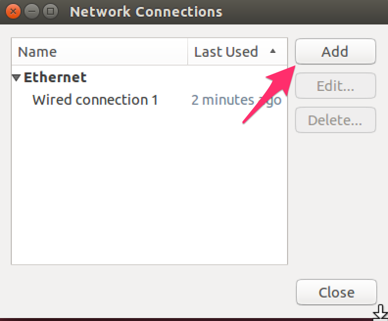
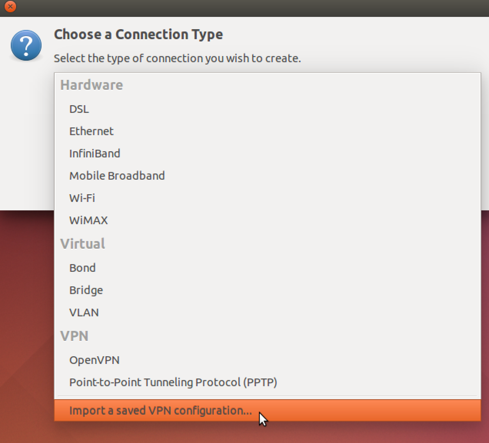
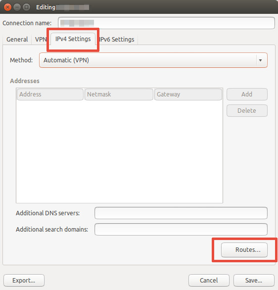
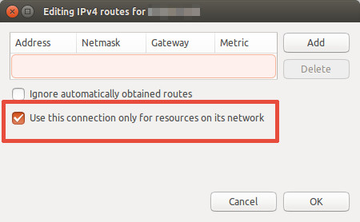

# Overview

This charm provides [OpenVPN Community VPN](http://openvpn.net/index.php/open-source).

This Charm installs and configures the VPN service and creates client certificates. What can you do with this Charm?

 1. Give remote users access to an internal network, including access to DNS server and search domain.
 2. Send all client traffic over the VPN. (using the VPN as default gateway)

# Usage

Please note that this charm must be deployed on physical or virtual machines. This Charm does not work in LXC/LCD containers. Also note that changing the key settings will cause existing client configs to fail.

**Metrics**

This Charm exposes the number of connected clients using a juju metric.

```bash
$ juju metrics --all
UNIT            	           TIMESTAMP	METRIC	VALUE
openvpn-puppet/0	2016-11-27T15:05:25Z	 users	    1
```

You can find more detailed status information on the unit itself.

```bash
# On the openvpn-puppet unit
sudo cat /var/log/openvpn/openvpn-server1-status.log
```


# Connecting to the VPN

**Get client config file**

Once the OpenVPN service is ready, you will need to download the user keys, certificates, and config generated during installation in order to connect. The charm creates an `<username>.ovpn` config file with this information whenever a new user is added and places it in the home directory of the default user. You can download this with `juju scp`.

```bash
juju scp openvpn-puppet/0:~/<client-name>.ovpn .
```

**Install OpenVPN client**

Install the OpenVPN network-manager integration. This will add the "VPN connections" menu in the network applet.

```bash
sudo apt install network-manager-openvpn-gnome
```

**Add VPN using config file**

1. Click the Network applet.
2. Choose `VPN connections > Configure VPN` as shown in the picture below.


3. Click *"Add"*.


4. Scroll all the way down and click *"import a saved VPN configuration"*.


5. Select the `.ovpn` config file, add the VPN, and connect using the network applet.

6. *[Optional] Regardless of server configuration, NetworkManager uses the VPN as default gateway, effectively sending ALL traffic over the VPN. If you set `push-default-gateway` to False and want NetworkManager to respect that setting, you need extra configuration. Edit the VPN connection > IPv4 Settings > Routes...'.*


7. *[Optional] Then mark "Use this connection only for resources on its network."*



**Alternative: start OpenVPN from commandline**

    sudo apt install openvpn
    sudo openvpn --config <client-name>.ovpn

# Configuration

- **push-dns** [`True`]: Set to False if clients shouldn't use the server's DNS settings.
- **push-default-gateway** [`True`]: Set to False if you want to use the VPN only for connections to servers in the private subnet. By default, ALL traffic will go over the VPN. Note that NetworkManager uses the VPN as default gateway regardless of server config. See steps `6.` and `7.` to change this behavior.
- **port** and **protocol**  [`443:tcp`]: `443:tcp` and `8080:tcp` have the least chance of being blocked by firewalls. `1194:udp` is the fastest.
- **key-*** : Information for key certificate. You don't actually need to change this.

# Contact Information

## Bugs

Report bugs on [the `tengu-charms` Github project](https://github.com/IBCNServices/tengu-charms/issues).

## Authors

This software was created in the [IBCN research group](https://www.ibcn.intec.ugent.be/) of [Ghent University](http://www.ugent.be/en) in Belgium. This software is used in [Tengu](http://tengu.intec.ugent.be), a project that aims to make experimenting with data frameworks and tools as easy as possible.

 - Merlijn Sebrechts <merlijn.sebrechts@gmail.com>
 - Images come from [TorGuard OpenVPN guide](https://torguard.net/knowledgebase.php?action=displayarticle&id=53).
